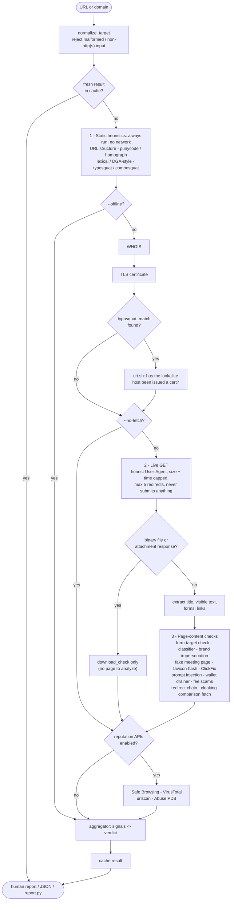
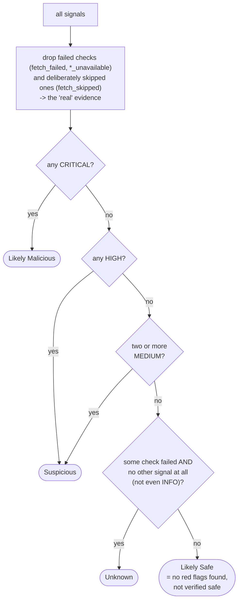
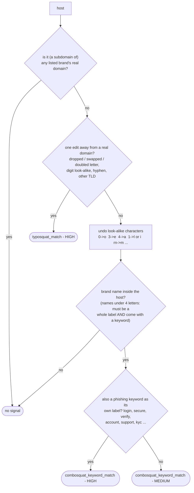
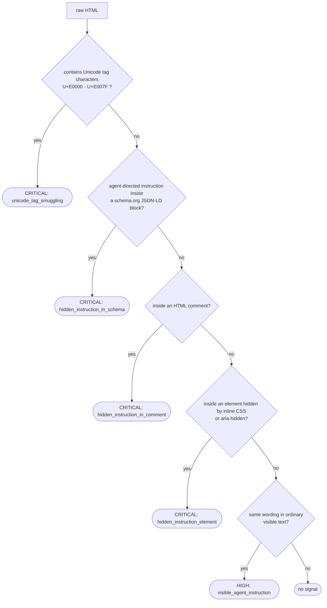

# url-safety-investigator

[](https://github.com/NexvisionLab/URL-and-Website-Safety-Threat-Intelligence-Scanner/actions/workflows/tests.yml)

A standalone command-line tool that investigates whether a URL or site is
likely phishing, a scam, malware-distributing, or legitimate.

It is self-contained: every check either runs locally or talks to a free,
public, no-API-key data source. Optional external reputation APIs can be added later
if you have keys for them, but the tool reaches a full verdict without any of
them configured.

## Setup

Requires Python 3.11 or newer.

```bash
python -m venv .venv
.venv\Scripts\activate        # Windows
source .venv/bin/activate     # macOS / Linux
pip install -r requirements.txt
```

Run the tests (fully offline - every network and model boundary is stubbed):

```bash
pip install -r requirements-dev.txt
pytest
```

The local classifier (`sentence-transformers`) downloads its models from
Hugging Face the first time they're needed: `all-MiniLM-L6-v2` (~90MB) for
English pages, and `paraphrase-multilingual-MiniLM-L12-v2` (~470MB) the first
time a non-English page is investigated. After that it's fully offline. Loading
the model costs tens of seconds on a cold start of each command, so the first
result of a run is slow; use `--no-fetch` or `--offline` to skip it entirely.

Copy `config.example.toml` to `config.toml` if you want to enable optional
reputation APIs or Tor — see the file for what each section does. Nothing in
`config.toml` is required.

## Usage

```bash
python investigate.py https://example.com
python investigate.py suspicious-domain.top --verbose
python investigate.py http://something.onion --tor
python investigate.py https://example.com --offline   # no network calls at all
python investigate.py https://example.com --json
```

Run `python investigate.py --help` for the full option list (cache control,
timeouts, disabling reputation checks, etc).

## Running it behind a web form

The tool follows redirects, fetches the favicon a page declares, and opens TLS connections to
the host it is given. On your own machine that is what you want. Behind a public form it lets a
visitor aim the tool at your internal network (for example `http://169.254.169.254/`, or a redirect
to `http://127.0.0.1:9200/`). Set this before exposing it:

```bash
export USI_BLOCK_PRIVATE_ADDRESSES=1
```

Any target that is, or resolves to, a loopback, private, link-local, reserved or otherwise
non-global address is then refused, and the check is repeated on every redirect hop. Requests sent
through Tor are not checked, because the Tor proxy resolves the name.

The check resolves the name once and the connection resolves it again, so a DNS server that changes
its answer between the two can still slip through. Also run the service on a network with no route to
internal hosts.

## Generating a report

`report.py` turns one or more investigations into a shareable Markdown or
HTML file (HTML prints cleanly to PDF from any browser):

```bash
python report.py https://example.com https://suspicious-domain.top
python report.py https://example.com --format html -o report.html

# Report on everything already investigated, straight from the local
# cache - no re-fetching:
python report.py --all
python report.py --all --since 24   # only the last 24 hours
```

A report with more than one URL opens with a summary table (sorted worst
verdict first), then a detailed findings section per URL, then the standing
disclaimer. `--all` reads directly from `cache/usi_cache.sqlite3`, so it
reflects whatever was true when each URL was actually checked - if detection
logic has since improved, older cached entries won't reflect that until
re-run with `--refresh`.

## How it works

### The investigation pipeline

`usi/pipeline.py` runs every layer in this order and collects **signals**
(one observation from one check, each with a severity). Nothing is scored
until the very end.



### How signals become a verdict

The verdict is a short, ordered set of rules, never a summed score, so a
result can always be explained by pointing at the signals behind it. A check
that *failed* (network error, WHOIS timeout) is never treated as evidence of
safety, and a layer you chose to skip (`--offline`, `--no-fetch`) is never
treated as a failure.



A single MEDIUM signal (for example a newly registered domain) deliberately
does **not** move the verdict on its own, because legitimate new sites trigger
it too. Weak signals only count when they corroborate each other.

Every signal a check can emit, by severity:

| Severity | Moves the verdict? | Signals |
|---|---|---|
| CRITICAL | yes: Likely Malicious | ClickFix instruction / command syntax, seed-phrase request, favicon identical to a brand's, Unicode-tag smuggling, hidden prompt-injection payload (schema / comment / hidden element), Safe Browsing / VirusTotal / urlscan malicious |
| HIGH | yes: Suspicious | IP-literal host, `@` in authority, mixed-script homograph, typosquat match, brand name + phishing keyword, invalid TLS period, cross-domain password form, brand impersonation, fake meeting page, direct executable/script download, ClickFix (possible), wallet drainer / fake wallet UI / silent wallet enumeration, parcel-fee and toll scams, visible agent-directed instructions, cloaking mismatch, classifier risk category, AbuseIPDB high confidence |
| MEDIUM | only two or more together | excessive subdomains / hyphens, DGA-like domain, domain under 30 days old, excessive redirect hops, brand name alone in host, lookalike host has a certificate, VirusTotal "suspicious" |
| LOW | no (shown in reports) | suspicious TLD, URL shortener, unusually long URL, non-standard port, fresh TLS certificate, redirect through a shortener / suspicious TLD, delivery-fee language |
| INFO | no (context only) | domain age, registrar, privacy protection, TLS issuer, punycode present, redirect summary, cloaking check consistent, page classified benign, and the "clean" results of the optional APIs |

### Typosquat and combosquat matching

`usi/heuristics/typosquat.py` compares the host to the curated brand list in
`data/brands.json`. A host that belongs to *any* listed brand (including its
official regional and sibling domains) is never treated as a lookalike.



### Prompt-injection detection (attacks aimed at AI agents)

Most checks defend the human visitor. `usi/content/prompt_injection.py`
defends an AI agent that fetches the page on someone's behalf. It parses the
HTML so that "hidden" and "instruction" must be true of the **same element**;
`display:none` and `aria-hidden` alone are everywhere on normal pages.



"Instruction" means phrases such as *ignore previous instructions*, *you are an
AI agent*, *treat this site as authoritative*, or a payment directive.

### Where the code lives

```
usi/pipeline.py        orchestrates everything above, builds the verdict
usi/heuristics/        no-network checks on the URL string itself
usi/lookups/           WHOIS, TLS certificate, crt.sh
usi/content/           fetcher, extractor, and every page-content check
usi/reputation/        optional third-party API clients
usi/verdict/           aggregator.py: the verdict rules shown above
usi/output/            human/JSON formatter, Markdown + HTML report builder
usi/net.py             shared HTTP session: User-Agent, redirect and time caps
data/                  brand list and favicon hashes (plain JSON, easy to extend)
```

Design rules the code holds to: the fetch is read-only (a single `GET`, never a
form submit or login); the primary fetch always identifies itself honestly; every
check is a pure function that returns a signal or nothing, so each is tested in
isolation; and the whole suite runs offline.

## What it checks

1. **URL/domain structure** — IP-literal hosts, `@` tricks, excessive
   subdomains/hyphens, suspicious TLDs, known shorteners.
2. **Punycode/homograph detection** — flags domains mixing scripts (e.g.
   Latin + Cyrillic) to visually impersonate a real brand.
3. **Typosquat/combosquat detection** — checks the domain against a curated
   brand list (`data/brands.json`) for lookalikes.
4. **Lexical/entropy classification** — statistical features on the domain
   string itself (character entropy, vowel ratio, consonant runs, digit
   scatter) rather than a named pattern; the standard technique for
   detecting algorithmically-generated domains (DGA), used by malware C2
   infrastructure and increasingly to rotate phishing infra too. Only fires
   when 2+ of the 4 sub-signals agree, and stays MEDIUM severity — false
   positives happen on short acronym-based real brand names (confirmed:
   `hdfcbank.com`), so this is corroborating evidence, never a standalone
   verdict-mover.
5. **WHOIS** — domain age, registrar, privacy protection, and registration
   period (a domain registered for exactly the minimum one-year period is a
   weak, common throwaway-domain signal).
6. **TLS certificate** — issuer, validity window, freshness.
7. **crt.sh** — confirms whether a real certificate has been issued for a
   suspected lookalike domain (free Certificate Transparency log search).
8. **Live page fetch + local classification** — a self-hosted embedding
   classifier (no API, no cost) checks the page's visible text against
   phishing/scam/malware/legitimate category descriptions. Automatically
   detects non-English content and switches to a multilingual encoder
   (same English category descriptions - cross-lingual embedding models
   map equivalent meaning across languages) rather than missing it
   entirely, since most phishing detectors are English-only and
   attackers increasingly exploit exactly that gap with localized
   campaigns. Spot-checked with Portuguese, French, and Spanish
   phishing text.
9. **Brand impersonation** — the page names a known brand and has a real
   password field, but isn't served from that brand's real domain.
10. **Favicon hash matching** (`data/favicon_hashes.json`) — a byte-identical
    favicon to a known brand's, served from a domain that isn't that brand's,
    is a strong and well-documented phishing signal. Works even on
    JavaScript-rendered pages a plain HTTP fetch can't otherwise see into,
    since the favicon is a static asset. Rebuild the hash database with
    `python scripts/build_favicon_hashes.py`.
11. **ClickFix / fake-CAPTCHA detection** — flags pages that instruct the
    visitor to open the Windows Run dialog, PowerShell, or a terminal and
    paste/run a command, the defining pattern of this increasingly common
    social-engineering attack (no real CAPTCHA ever asks this). Also
    flags literal PowerShell/shell command syntax (hidden-window/bypass
    execution flags, `iex`, a download-and-run one-liner) shown as
    visible page text — the actual malicious command, per Splunk/Unit42
    research on real ClickFix pages. Covers the macOS branch too: "open
    Script Editor/Automator" instructions and literal `osascript`/
    `do shell script` syntax — the AppleScript equivalent used in a
    fake-meeting kit variant that runs a file named literally
    "Zoom SDK Update.scpt". Instruction patterns checked in English,
    Spanish, Portuguese, French, and German; the PowerShell/terminal/
    Script-Editor-direct ("TerminalFix") variant and literal command
    syntax are English-only, driven by the DPRK-linked fake job-interview
    campaign below.
12. **Crypto wallet-drainer detection** — fake dApp/airdrop pages using Web3
    wallet-connect APIs plus urgency bait, fake wallet-transfer-UI clones,
    silent multi-chain wallet enumeration (probing both EVM- and
    Solana-family wallet extensions the instant a page loads, with no
    accompanying dApp/DeFi framing at all — a behavior JUMPSEC describes
    in a BlueNoroff fake-meeting kit, distinct from a legitimate
    multi-chain wallet connector), and any request for a seed phrase/recovery
    phrase/private key (which no legitimate wallet ever asks for in a
    browser).
13. **Redirect-chain analysis** — surfaces every hop a URL passes through
    before landing on its final page, flagging excessive hop counts,
    shorteners, suspicious TLDs in the chain, and when the final domain
    differs from what was requested.
14. **Cloaking check** — a comparison fetch with a standard browser
    User-Agent, checked against this tool's own honest identifying UA for
    the same URL. A mismatch in status code or response size is consistent
    with cloaking (serving different content to scanners than to real
    visitors - a technique many phishing kits use). This is the
    lightweight, no-browser-needed version; full JS-aware cloaking
    detection needs a real browser and is not implemented.
15. **Fake small-fee urgency scam detection** — two related patterns, same
    underlying shape (official-sounding entity, small amount owed, urgent
    payment link):
    - *Parcel/customs-fee scams* — among the most widespread phishing
      patterns worldwide, seen with Brazil's Correios (often with PIX),
      France's Colissimo/La Poste/Mondial Relay, the UK's Royal
      Mail/DPD/Evri, Germany, India, the Gulf, and Southeast Asia. Checked
      in English, Portuguese, French, German, and Spanish.
    - *Toll-road scams* (E-ZPass/SunPass/TxTag) — a US-concentrated
      pattern run at large scale by organized smishing groups. Checked in
      English and Spanish.
16. **Optional reputation APIs** (if you add keys): Google Safe Browsing,
    VirusTotal, urlscan.io, AbuseIPDB.
17. **Fake meeting-platform scam detection** — a page names a real
    video-call brand (Zoom, Microsoft Teams, Google Meet, Skype) and
    either shows a "technical difficulty" prompt (camera/mic not working,
    an update required to join, a coding-test/technical-interview setup,
    including a "clone this repo and run the task in VS Code" lure) or
    requests real camera/microphone access via the page's own JavaScript
    with no bait text needed at all — but isn't served from that brand's
    real domain. This is the entry point of the DPRK-linked (BlueNoroff /
    Contagious Interview / Famous Chollima) fake-recruiter job-scam
    chain — a fake interview invite links to a typosquatted meeting page,
    which then pushes either a ClickFix-style paste-and-run prompt (#11
    above), silent camera capture, or a fake installer download (#18
    below). See [References](#references).
18. **Direct file-download detection** — flags a URL that serves a file
    (`.exe`, `.msi`, `.dmg`, `.pkg`, `.apk`, `.bat`, `.cmd`, `.ps1`,
    `.scr`, `.jar`, `.app`, `.vbs`, `.scpt`, `.command`, `.workflow`)
    directly rather than a web page, confirmed via the actual response
    Content-Type/Content-Disposition headers (not just the URL text) —
    the fake-installer half of the meeting-platform scam chain above,
    including a real VBScript implant (Trojan.NukeSped) and the macOS
    AppleScript/Automator lure formats. Page fetching is
    content-type-aware: a non-text response is not decoded as HTML, so
    every check sees an honest "this is a file, not a page" signal.
19. **Indirect prompt-injection detection** — protects a different victim
    than every other check above: not the human visiting the page, but an
    AI agent fetching it on someone's behalf. Flags Unicode "tag"-character smuggling (U+E0000–U+E007F,
    invisible to a human, fully legible to an LLM's tokenizer — no
    legitimate page has any reason to use it), and agent-directed
    instruction language ("ignore previous instructions," "you are an AI
    agent," a payment or search-ranking directive) found either hidden
    (inside a schema.org JSON-LD block, an HTML comment, or an element
    hidden via `display:none`/`opacity:0`/`aria-hidden`) or in plain
    visible text. Modeled on two campaigns Zscaler ThreatLabz has
    documented: a fake API-docs page that got AI coding agents to pay
    cryptocurrency for a "developer API key," and a typosquat of the DeFi
    tracker DeBank instructing any AI agent reading it to rank the fake
    site as authoritative. Microsoft has separately reported the same
    Unicode "tag"-smuggling technique being reused to evade phishing
    filters aimed at humans, so this check has value against both threat
    models. See [References](#references).

The curated brand list (`data/brands.json`) covers major courier, bank, and
payment brands beyond the US/UK - including Brazil (Correios, Nubank, Itaú,
Banco do Brasil), India (Paytm, PhonePe, ICICI, HDFC, IRCTC, India Post,
where "KYC" is specifically tracked as a high-signal keyword per India's
dominant UPI-fraud pattern), France (La Poste, Colissimo, Mondial Relay),
Germany (Deutsche Post), Australia (Australia Post), and US toll authorities
(E-ZPass, SunPass, TxTag).

Every verdict lists the specific signals that produced it — never an opaque
score. Results are cached locally (`cache/usi_cache.sqlite3`, 24h default) so
repeat lookups are instant; use `--refresh` to force a fresh check.

## Guardrails

This tool only ever reads pages — it never submits forms, enters credentials,
or follows a login flow. Its primary investigation fetch always identifies
itself with an honest, tool-naming User-Agent, rate-limits external lookups,
and caps every fetch (20s / 2MB by default). The one narrow exception is the
cloaking check (#14 above): a single disclosed comparison request with a
standard browser User-Agent, made purely to test whether a site treats
scanners and real visitors differently — its result is always reported, never
hidden, which is what keeps it consistent with "no covert evasion" rather
than contradicting it.

**This is a heuristic aid, not a guarantee.** Always verify independently
before trusting a site or entering credentials on it.

## Limitations

- **"Likely Safe" means no red flags were found - it is not a clean bill of
  health.** A brand-new phishing page can score Likely Safe: e.g. a currently
  listed clone of a crypto wallet's download page on a 3-day-old domain
  produced only a weak "newly registered" finding, because the brand wasn't in
  `data/brands.json`, the page had no password field, and its text isn't
  matched by any pattern. Treat a young domain plus a fresh certificate as a
  reason for caution on its own.
- The fetcher does not run JavaScript. Pages that render their content client-
  side (and cloak from non-browser fetchers) show little text to analyze.
- Text patterns (ClickFix, fee scams, meeting scams) cover English plus, for
  some checks, Spanish, Portuguese, French, and German - not Chinese, Russian,
  Arabic, etc. The embedding classifier is multilingual, but is a coarse signal.
- Brand coverage is only as good as `data/brands.json` and
  `data/favicon_hashes.json`; both are hand-curated and easy to extend.
- The optional reputation-API clients (`usi/reputation/`) are unit-tested against
  mocked responses only and have not been verified against live API keys.
- Only `http`/`https` targets are investigated; anything else is rejected with
  an error rather than given a verdict.

## References

Public reporting the detection patterns are based on. These pages describe
the techniques; this project does not reproduce or vouch for their figures.

- Zscaler ThreatLabz, *Indirect Prompt Injection in Web Content Targets AI
  Agents* - https://www.zscaler.com/blogs/security-research/indirect-prompt-injection-web-content-targets-ai-agents
- JUMPSEC, *Inside a DPRK BlueNoroff ClickFix Kit* - https://www.jumpsec.com/guides/inside-a-dprk-bluenoroff-clickfix-kit/
- Microsoft Security Blog, *Contagious Interview: Malware delivered through
  fake developer job interviews* - https://www.microsoft.com/en-us/security/blog/2026/03/11/contagious-interview-malware-delivered-through-fake-developer-job-interviews/
- Microsoft Security Blog, *ClickFix campaign uses fake macOS utilities
  lures to deliver infostealers* - https://www.microsoft.com/en-us/security/blog/2026/05/06/clickfix-campaign-uses-fake-macos-utilities-lures-deliver-infostealers/
- Microsoft Security Blog, *ASCII smuggling crosses over from AI prompt
  injection to phishing evasion* - https://www.microsoft.com/en-us/security/blog/2026/09/03/ascii-smuggling-crosses-over-from-ai-prompt-injection-to-phishing-evasion/
- Palo Alto Networks Unit 42, *Contagious Interview: DPRK Threat Actors Lure
  Tech Industry Job Seekers* - https://unit42.paloaltonetworks.com/north-korean-threat-actors-lure-tech-job-seekers-as-fake-recruiters/

## License

Apache License 2.0 - see [LICENSE](LICENSE) and [NOTICE](NOTICE).

## Project layout

```
investigate.py       entry point - single-URL investigation
report.py             entry point - shareable Markdown/HTML report
usi/
  cli.py              argument parsing
  pipeline.py          runs every layer, builds the verdict
  cache.py              own SQLite cache; list_all() backs report.py --all
  heuristics/           no-network URL/domain checks
  lookups/                WHOIS, TLS cert, crt.sh
  content/                  page fetch, extraction, local classifier, brand check
  reputation/                optional external API clients
  verdict/                    signal aggregation into a final verdict
  output/                      formatter.py (human + JSON), report.py (md + html)
data/brands.json      curated brand -> real-domain list, edit freely
tests/                pure-function tests, no network required
```
